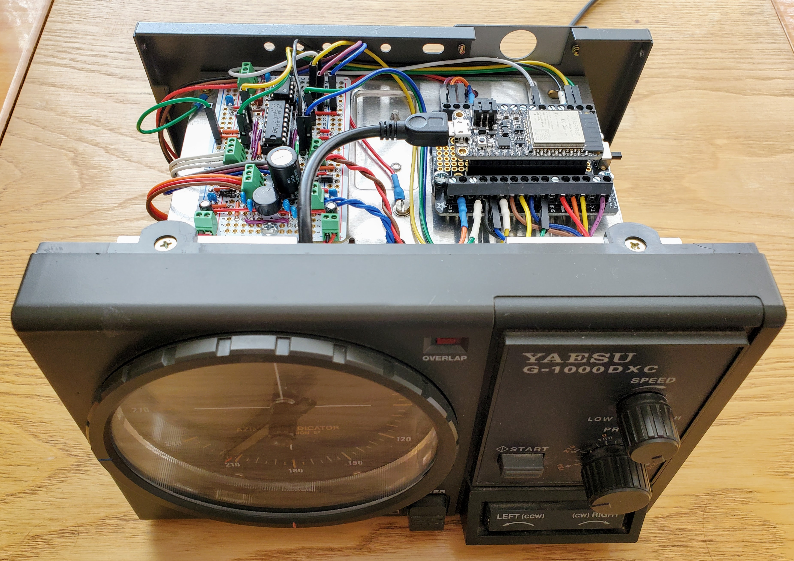

# ESP32 Yaesu G-1000DXC Antenna Rotator Controller

An ESP32-based replacement for the logic board in the Yaesu G-1000DXC antenna rotator controller. The replacement provides the same functionality as the original logic board, except that all control is implemented in software written in C++ (Arduino ESP32 sketch). When the ESP32 MCU is connected to Wi-Fi, the software also provides a rudimentary web-based user interface for monitoring and control. The following photo shows a modified controller. More photos can be found [here](photos). A schematic diagram can be found [here](schematic.pdf).

